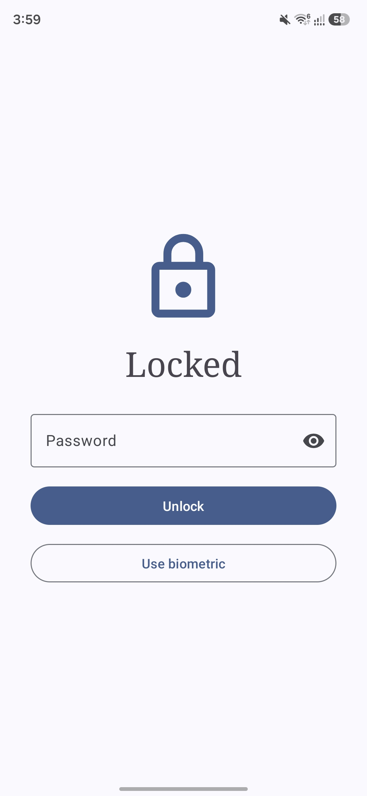
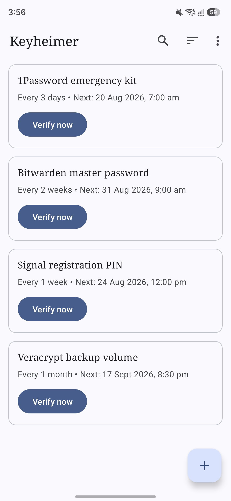
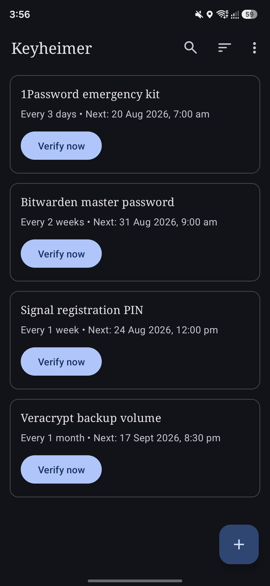
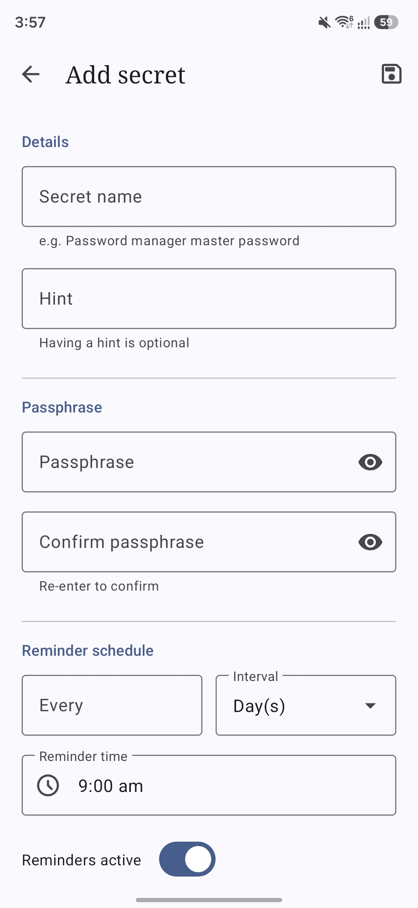
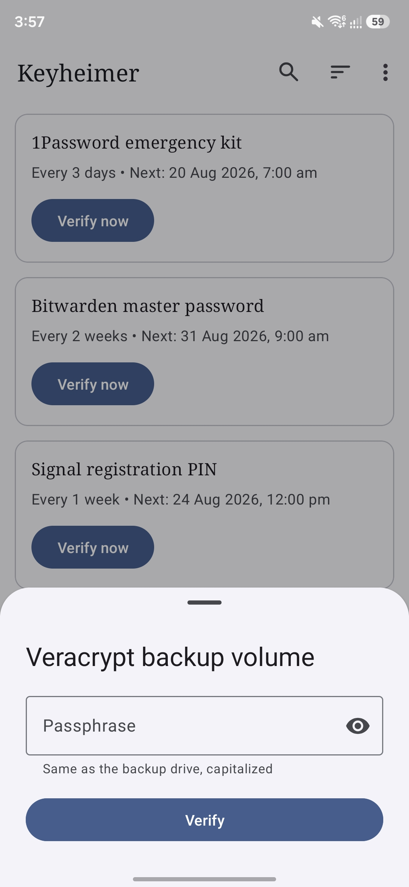
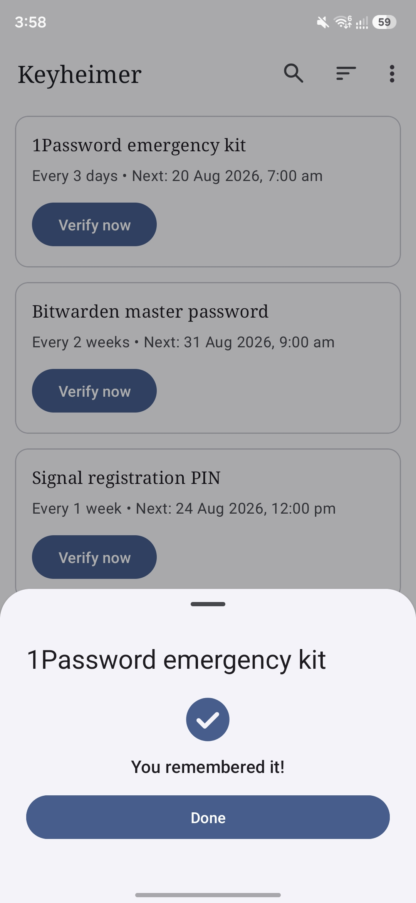

<div align="center">


# Keyheimer

**Never forget the passphrase that protects everything else.**

Keyheimer is a simple, open-source app that helps you actually remember the master passphrases guarding your password manager and encrypted backups. It works by scheduling recall checks, not by storing your passphrases in any recoverable form — there's no account, no server, and nothing saved that could ever be read back to you or anyone else.

</div>

## Features

* **Free and Open Source:** Enjoy complete transparency and community-driven development.
* **Hash-Only, By Design:** Passphrases are never stored in plaintext or in any recoverable form — only a salted PBKDF2 hash, the same way a real authentication system verifies a password. There is no "reveal" option, because there's nothing stored that could be revealed.
* **Flexible Reminders:** Set any interval — days, weeks, or months — and the exact time of day you want to be reminded, down to the minute.
* **Recall, Not Autofill:** Tapping a reminder — or "Verify now" from the list — opens a quick passphrase check. Get it right and the next reminder is scheduled; get it wrong and you're told plainly, with an optional hint and a way to reset if you're stuck.
* **Security Screen:** Screenshots and screen recording are blocked by default on every screen, including passphrase verification.
* **Fully Offline:** Keyheimer requests no internet permission at all — it is architecturally incapable of sending your data anywhere. You can verify this yourself in your system's app settings.

## Screenshots

<div align="center">
	<div>
	  
    
    
	  
    
    
	</div>
</div>

## Verification

APK releases on GitHub are signed using my key. They can
be verified using
[apksigner](https://developer.android.com/studio/command-line/apksigner.html#options-verify):

```
apksigner verify --print-certs --verbose keyheimer.apk
```

The output should look like:

```
Verifies
Verified using v1 scheme (JAR signing): false
Verified using v2 scheme (APK Signature Scheme v2): true
Verified using v3 scheme (APK Signature Scheme v3): false
Verified using v3.1 scheme (APK Signature Scheme v3.1): false
Verified using v3.2 scheme (APK Signature Scheme v3.2): false
Verified using v4 scheme (APK Signature Scheme v4): false
```

The certificate fingerprints should correspond to the ones listed below:

```
Owner: CN=Mowtiie
Issuer: CN=Mowtiie
Serial number: 8a256fdcdde50069
Valid from: Wed Jun 10 22:57:23 PST 2026 until: Sun Oct 26 22:57:23 PST 2053
Certificate fingerprints:
         SHA1: 56:4E:2C:DB:E4:06:C9:EC:15:E6:BC:D9:0A:88:38:72:8B:FB:13:20
         SHA256: 8B:67:51:F3:C3:31:85:63:5F:98:95:30:B6:C0:73:A1:39:7B:3D:41:2B:EF:AE:69:06:A2:EB:58:45:D2:DE:63
```

**Warning:** Only install Keyheimer APKs signed with the key above. Verifying the signature confirms you're running a genuine, unmodified build.

### PGP Signing

As an additional layer on top of the Android signature above, each release is also signed with my PGP key. While `apksigner` confirms the APK itself is intact, a PGP signature confirms that *I* am the one who published this specific file to GitHub — an independent check that doesn't rely on GitHub's account security alone.

**Public key fingerprint:**
```
9EA2 8F46 7802 5092 7643 1B69 42B5 FA42 AA63 90E1
```

Download and import the key from my website, or directly from this repo:

```
curl -O https://mowtiie.cc/PGP_PUBLIC_KEY.asc
gpg --import PGP_PUBLIC_KEY.asc
```

After importing, confirm the fingerprint printed by GPG matches the one listed above — that match is what actually establishes trust, not the import step itself. Fetching the key over HTTPS from a domain you already trust is arguably a stronger anchor than a keyserver, since keyservers accept uploads from anyone and don't vouch for identity.

Each release includes a detached `.asc` signature alongside the APK. Verify a downloaded release with:

```
gpg --verify keyheimer-vX.X.apk.asc keyheimer-vX.X.apk
```

A valid signature looks like:

```
Good signature from "Mowtiie <mowtiie.dev@gmail.com>"
```

**Note:** PGP signing is a supplementary trust measure, not a substitute for the `apksigner` check above — verify both if you want the highest confidence that a release is genuine and unmodified.

## Mapping Files

Each release on GitHub includes a `mapping-<version>.txt` file alongside the APK. This file is needed to deobfuscate stack traces from crash reports — match the file to the version shown in the crash report header and use it with `retrace` from the Android SDK.

## Contributing

Issues and pull requests are welcome. If you're filing a bug, please include your Android version and the steps to reproduce.

## License

This project is licensed under the GNU General Public License v3.0. See the
[LICENSE](LICENSE) file for details.
